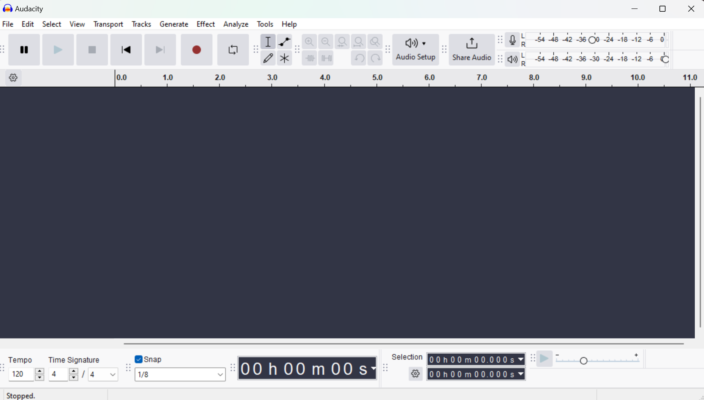

  <h2>How to Open File in Audacity</h2>

  

When you first launch the Audacity app, you begin recording your audio by pressing the red button at the top of the screen. When you have finished creating, press the square stop button.

[Next](use_effect.md)

[Go back to Homepage](README.md)
