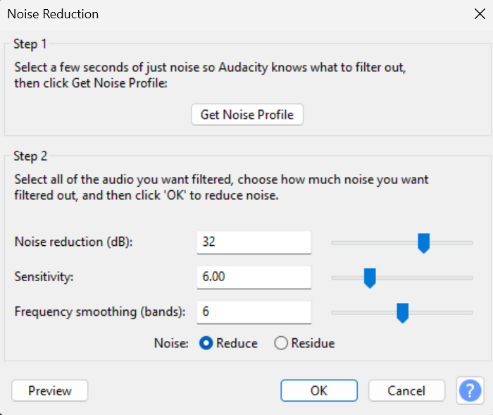

  <h2>How to use the 'Noise Reduction' Effect</h2>

  

  

Once you are satisfied with your audio, highlight the section that you want to remove the background noise from. Once you have highlighted your problem area, navigate to the effects tab at the top of your screen. Next, you will go down to the Noise Removal and Repair button. After you click on that, then go to noise reduction. You can then adjust the levels until you are satisfied with the results!

[Next](export.md)

[Go back to Homepage](README.md)
